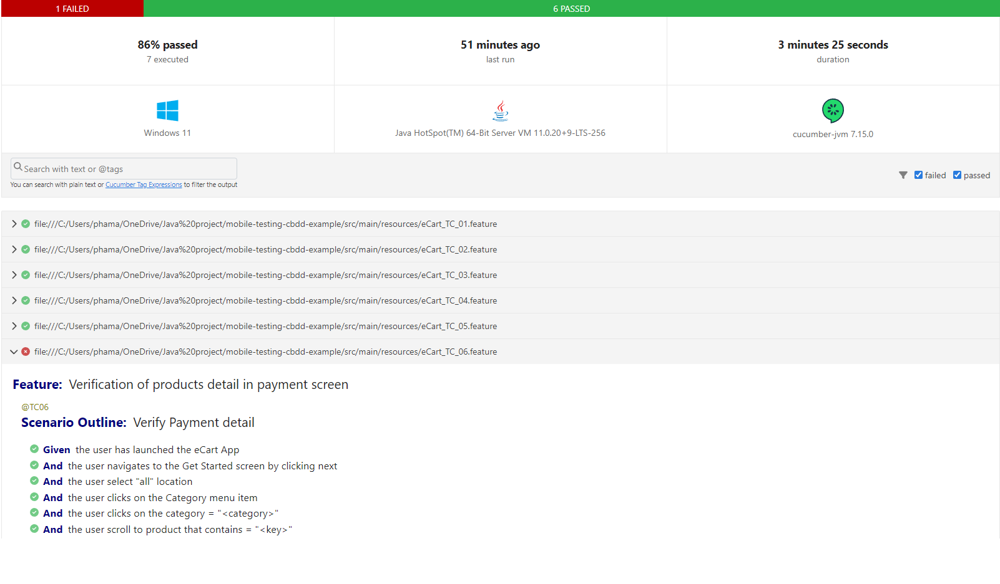
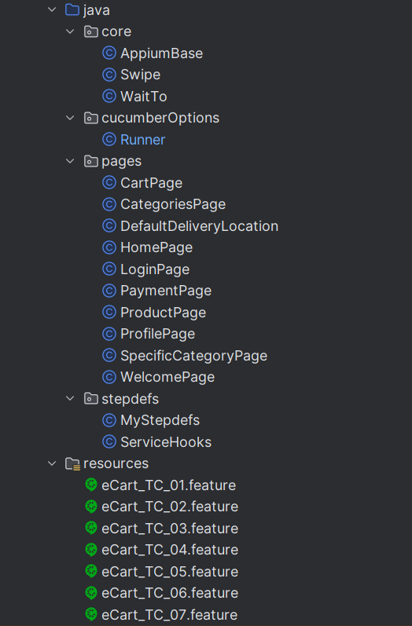

# eCard Multi Vendor Automation Testing
This is one of my projects showcasing how I develop automation testing for mobile applications using [eCart Multi Vendor Customer](https://play.google.com/store/apps/details?id=wrteam.multivendor.customer) as an example.

## Framework
- Appium (to interact with mobile application)
- Selenium (to find elements)
- TestNG (for assertion)
- Cuccumber
- Maven

## Tests
### Test Suite
There are 7 test cases (can be found in [here](test-cases.md)), with the objective of covering critical functionality on each screen, or in another word, smoke test.

### Results
The video below presents the test script execution:

When finished, a report will be exported and will look like this:

## Method
The framework I used is organized following the Page Object Model combined with BDD. All test artifacts are placed in the main package (which might not be ideal tbh). 
The structure looks like this, with the Runner class responsible for executing all the test cases:
  
From this project, I learned two interesting things: 
1. Is how to create a swipe function on my own to target a specific element, which I named **swipeInBoxUntilElementAppear()** that can be found in Swipe class.
2. A special insight into projects that require frequent swiping. In such cases, some elements might be hidden (not yet swiped to), which means that the **@FindBy** annotation from Selenium cannot be used. Instead, I had to use **AppiumBy** to locate the elements.
